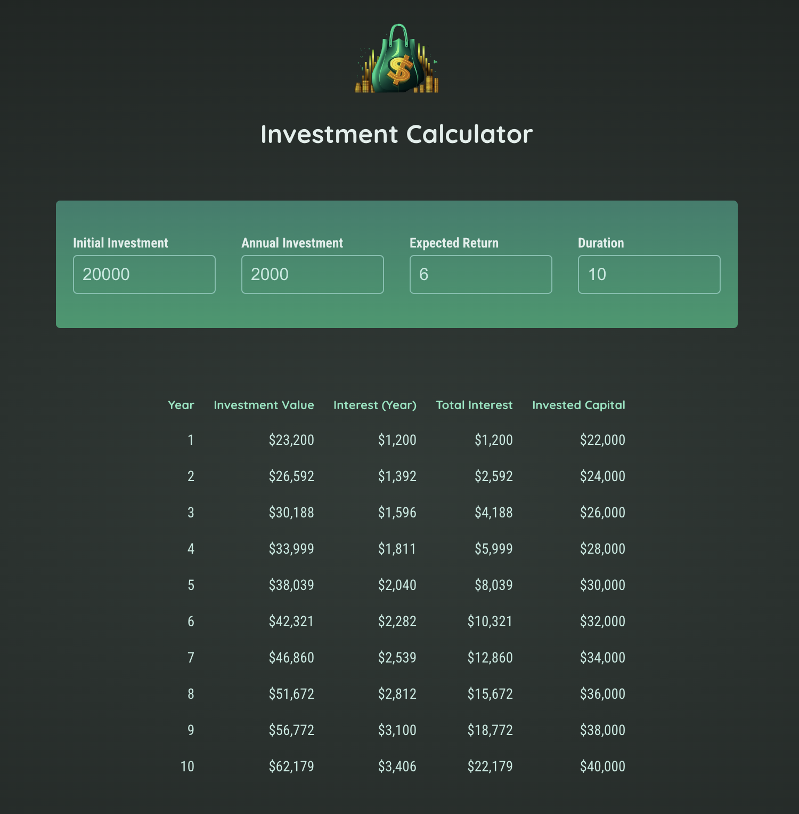

# App Overview

The app provides a finanical investment calculator that shows the results of any size of investment amount within any specified time period and at any return rate.

- Live URL (Hosted with Firebase): https://investment-calculator-reactjs.web.app/

## User Story

An financial investor wants to make a profit analysis by playing around the amount of their initial investment and annual investment they put in to calculate the gain over a specified time period at any given return rate.

## Techniques applied

- Handling user input by using the 2-way binding technique
- Lifting state to upper component
- Computing values & properly handling number values
- Outputting results in a list & deriving more values
- Outputting content conditionally

## Technologies Used

- React
- JavaScript
- HTML 5
- CSS

Note: I coded along while following React course by Academind @ https://github.com/academind
